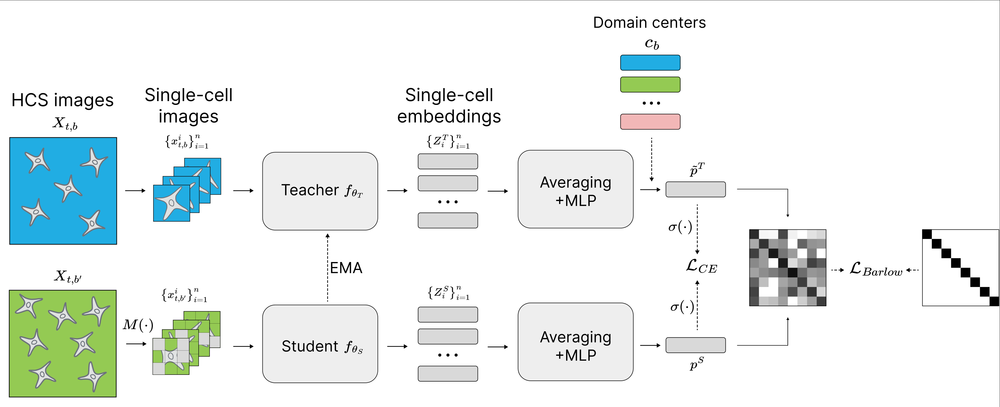

# [Scheduled Cross-Domain Multi-Center DINO for Robust High-Content Screening Representation Learning]()

High-Content Screening (HCS) is a powerful tool in drug discovery, enabling the analysis of complex cellular responses. This work presents SCMC-DINO, a novel self-supervised framework that enhances the single-cell set-DINO approach by integrating metadata-guided consistency learning. Our method employs a student-teacher distillation strategy and introduces key modifications such as distance-based centering, cross-domain scheduling, and student input masking to improve the extraction of fine-grained cellular features. These enhancements balance sensitivity to subtle treatment effects with robustness against batch-specific variations. Our experiments demonstrate that integrating these modifications significantly boosts performance across datasets with varying levels of treatment signal. We evaluate SCMC-DINO on two HCS datasets, CPG0004 and RXRX1-HUVEC. On CPG0004, our approach significantly improves treatment classification and mode of action accuracy while reducing batch effects. In contrast, multi-cell methods outperform single-cell approaches in RXRX1-HUVEC due to sparse treatment signals. Overall, our results highlight the potential of combining single-cell information with global image context to achieve robust representation learning for HCS in drug discovery applications.

### *Our approach*

<p align="center">
  
</p>


## Datasets

The datasets can be downloaded from their respective sources: 

[RxRx1](https://www.rxrx.ai/rxrx1)

[CPG0004](https://github.com/broadinstitute/cellpainting-gallery)

The datasets are build using the functionality in ```build_data/```


## Usage:
* Training: ```python classification.py```
* Training with DINO: ```python classification.py --dino```
* Testing (using json file): ```python classification.py --test```
* Testing (using saved checkpoint): ```python classification.py --checkpoint CheckpointName --test```

## Run RxRx1
```python classification.py --params_path run_settings/params_rxrx1_singlecell.json --single_cell --split_number=1``` 


## Run CPG0004

```python classification.py --params_path run_settings/params_cpg_singlecell.json --single_cell --split_number=1```


## Code Credits

This repository builds upon:
- [cfredinh/CDCL](https://github.com/cfredinh/CDCL) 

 